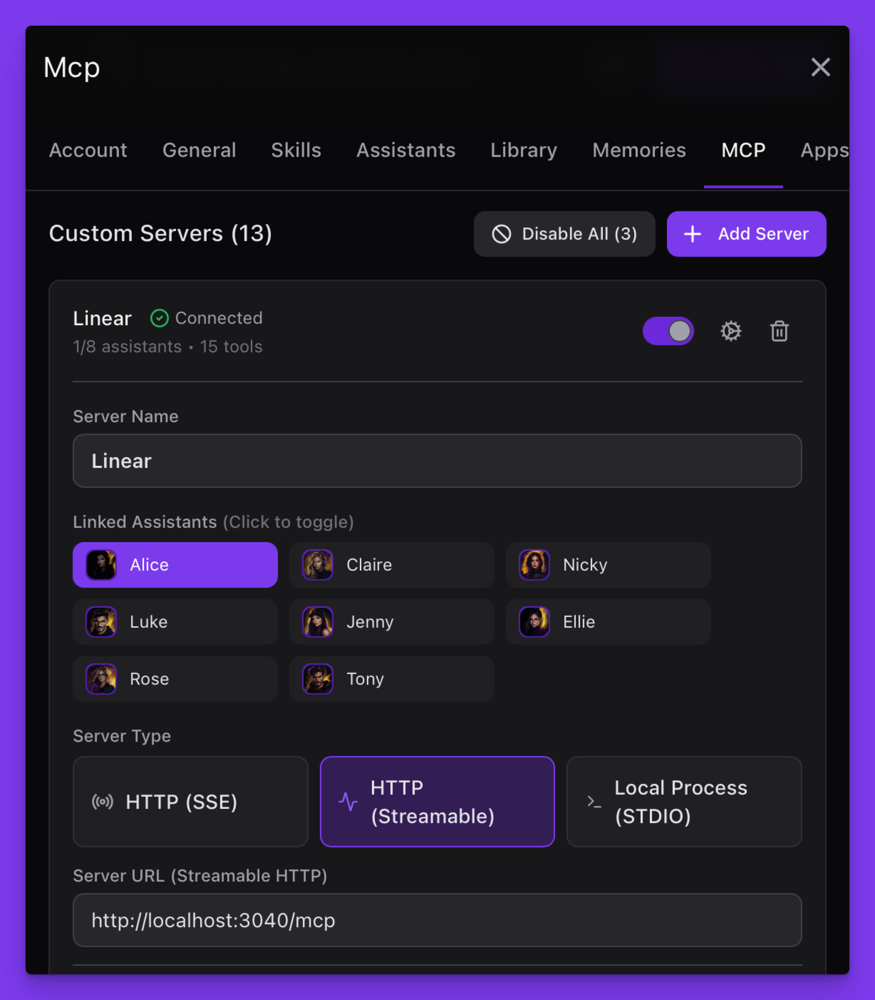
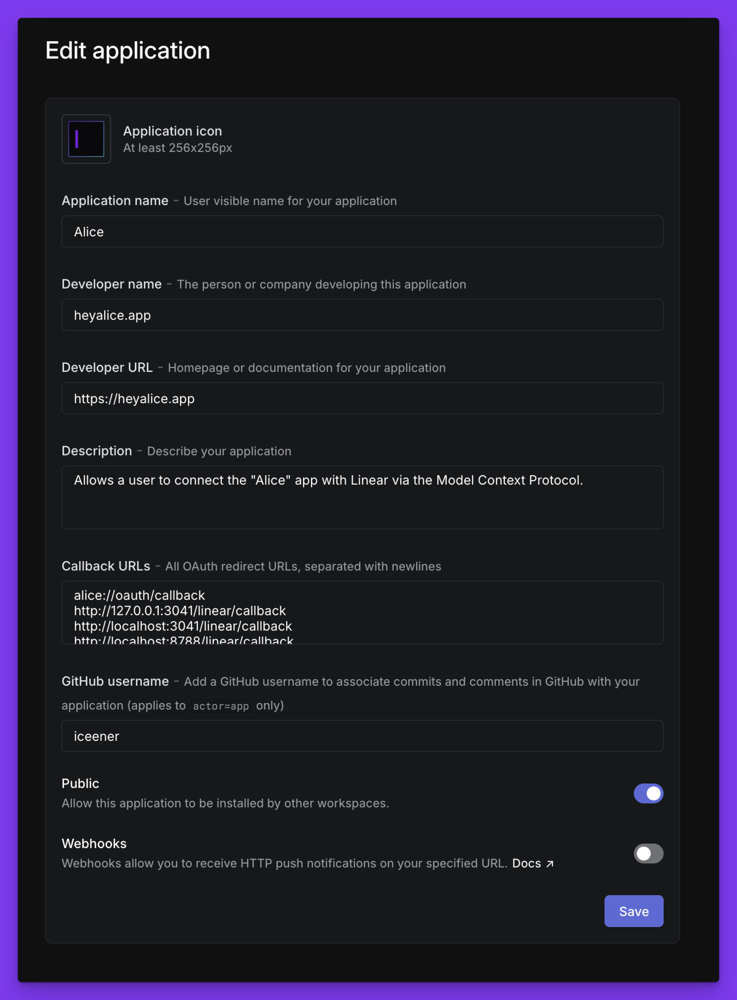
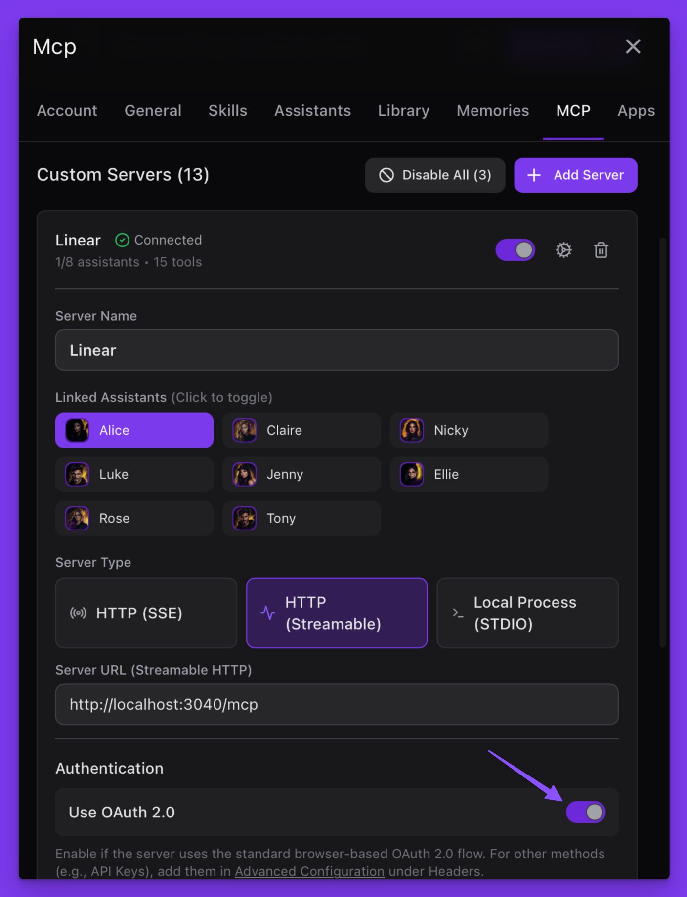

# Linear MCP Server (HTTP / OAuth / Remote)

> Warning: You connect this server to your MCP client at your own responsibility. Language models can make mistakes, misinterpret instructions, or perform unintended actions. Review tool outputs, verify changes (e.g., with `list_issues`), and prefer small, incremental writes. In production, enforce least‑privilege credentials, audit logs, and approval workflows.

A streamable HTTP MCP server for Linear that lets you manage issues, projects, teams, users, comments, and cycles — locally or remotely.

### Notice

This repo works in two ways:

- As a Node/Hono server for local workflows
- As a Cloudflare Worker for remote interactions

The HTTP/OAuth setup here is designed for convenience during development, not for production‑grade security. If you’re deploying to Cloudflare, see [Remote Model Context Protocol servers (MCP)](https://blog.cloudflare.com/remote-model-context-protocol-servers-mcp) for details.

### Motivation

I’m a big fan of [Linear](https://linear.app) and use it daily — for both personal projects and professional workflows, including automations. At the time of writing, the official MCP server isn’t fully optimized for language models (this may change soon, as Linear is actively improving it).

This server is built with a few key goals in mind:

- Let LLMs easily find things like Team IDs, Project IDs, Status IDs, or User IDs in a single action (`workspace_metadata`) instead of calling multiple tools just to gather required data.
- Include clear MCP instructions and schema descriptions that cut API jargon, making it more likely the model uses the right tool in the right order.
- Map API responses into human‑readable feedback — useful for both the LLM and the user.
- Provide hints and suggestions for next steps, plus tips on using available data or recovering from errors.
- Support batch actions (e.g., `add_issues` instead of `add_issue`) so the LLM can perform multiple steps in one go.
- Prefetch related values — for example, return both a status ID and the actual status name for an issue.
- Hide tools not enabled in a given team’s settings (like `cycles_list`) to reduce noise.
- Adjust schemas to match workspace preferences, such as issue priority formats.

In short, it’s not a direct mirror of Linear’s API — it’s tailored so AI agents and chat clients know exactly how to use it effectively.

## Installation & development

Prerequisites: [Bun](https://bun.sh/), [Node.js 24+](https://nodejs.org), [Linear](https://linear.app) account. For remote: a [Cloudflare](https://dash.cloudflare.com) account and the [Wrangler](https://www.npmjs.com/package/wrangler) package.

You also need an MCP client such as:

- [HeyAlice](https://heyalice.app) (my personal project)
- [Claude](https://claude.ai)

### Ways to run (pick one)

1. Local (API key)
2. Local + OAuth
3. Cloudflare Worker — wrangler dev (local Worker)
4. Cloudflare Worker — remote deploy

### 1) Quick start (local workflow with API key)

This is the easiest way to start. Run the server with your Linear Personal Access Token (Settings → Security).

https://linear.app/[your-account-name]/settings/account/security

```bash
git clone https://github.com/iceener/linear-streamable-mcp-server
cd linear
bun install
cp env.local-api.example .env
# Update your Linear API key in .env
bun dev
```

Now connect this server to Alice (Settings → MCP) and set it up as follows:



Or use Claude Desktop with the following settings:

```bash
{
  "mcpServers": {
    "remote-example": {
      "command": "bunx",
      "args": [
        "mcp-remote",
        "http://localhost:3040/mcp",
        "--header",
        "Authorization: ${LINEAR_API_KEY}"
      ]
    }
  }
}
```

### 2) Alternative: Local + OAuth

This is a more advanced workflow because it requires creating an OAuth application in Linear. Example:



```bash
git clone https://github.com/iceener/linear-streamable-mcp-server
cd linear
bun install
cp env.local-oauth.example .env

# Update OAUTH_CLIENT_ID and OAUTH_CLIENT_SECRET
# Add the following redirect URIs:
# alice://oauth/callback
# http://127.0.0.1:3041/linear/callback
# http://localhost:3041/linear/callback
# http://localhost:8788/linear/callback
# https://claude.ai/api/mcp/auth_callback
# https://claude.com/api/mcp/auth_callback
# https://<worker-name>.<account>.workers.dev/linear/callback

bun dev
```

Tip: the local Authorization Server (for OAuth) runs on PORT+1. If `PORT=3040`, auth is on `http://localhost:3041`.

When the server is up, connect to Alice:



Alternatively, connect with Claude Desktop:

```bash
{
  "mcpServers": {
    "linear": {
      "command": "bunx",
      "args": [
        "mcp-remote",
        "http://localhost:3040/mcp",
        "--transport",
        "http-only"
      ],
      "env": { "NO_PROXY": "127.0.0.1,localhost" }
    }
  }
}
```

#### RS‑only mode (recommended for remote clients)

Enable these flags to require RS‑minted bearer tokens. When enabled, requests without `Authorization` or with a non‑mapped `Bearer <opaque>` will receive `401` with `WWW-Authenticate` so OAuth can start (works with `mcp-remote`).

```env
# Challenge when Authorization missing or not one of our RS tokens
AUTH_REQUIRE_RS=true

# If you still want to allow Linear PATs as Bearer in RS‑only mode, set:
AUTH_ALLOW_LINEAR_BEARER=false
```

### 3) Cloudflare Worker — wrangler dev (local Worker)

Fast way to test the Worker locally.

```bash
cd linear
bun x wrangler dev --local | cat
```

If you want to pass a PAT directly in dev:

```bash
cd linear
bun x wrangler secret put LINEAR_API_KEY
bun x wrangler dev --local | cat
```

With OAuth, also set:

```bash
cd linear
bun x wrangler secret put OAUTH_CLIENT_ID
bun x wrangler secret put OAUTH_CLIENT_SECRET
# Ensure OAUTH_SCOPES and allowlist in wrangler.toml
bun x wrangler dev --local | cat
```

Endpoint (dev): `http://127.0.0.1:8787/mcp` (Wrangler prints the exact port).

### 4) Cloudflare Worker — remote deploy

Wrangler reference (already included as `linear/wrangler.toml`):

```toml
name = "linear-mcp-worker"
main = "src/worker.ts"
compatibility_date = "2025-06-18"
workers_dev = true
compatibility_flags = ["nodejs_compat"]

[vars]
MCP_PROTOCOL_VERSION = "2025-06-18"
AUTH_ENABLED = "true"
AUTH_REQUIRE_RS = "true"
AUTH_ALLOW_LINEAR_BEARER = "false"
OAUTH_AUTHORIZATION_URL = "https://linear.app/oauth/authorize"
OAUTH_TOKEN_URL = "https://api.linear.app/oauth/token"
OAUTH_SCOPES = "read write"
OAUTH_REDIRECT_ALLOW_ALL = "false"       # dev helper; keep false in prod
OAUTH_REDIRECT_URI = "alice://oauth/callback"
OAUTH_REDIRECT_ALLOWLIST = "alice://oauth/callback,https://claude.ai/api/mcp/auth_callback,https://claude.com/api/mcp/auth_callback,https://<worker-name>.<account>.workers.dev/linear/callback"
NODE_ENV = "development"                 # allows localhost callback in dev

[[kv_namespaces]]
binding = "TOKENS"
id = "REDACTED"
```

Deploy with API key:

```bash
cd linear
bun x wrangler secret put LINEAR_API_KEY
bun x wrangler deploy
```

Endpoint: `https://<worker-name>.<account>.workers.dev/mcp`.

---

## Environment examples

- Local (API key): `env.local-api.example`
- Local + OAuth: `env.local-oauth.example`
- Generic defaults: `env.example`

### Remote (Cloudflare Worker) with OAuth

1. Create KV for token mapping and add it to `wrangler.toml`:

```bash
bun x wrangler kv namespace create TOKENS
```

2. Set secrets and vars:

```bash
cd linear
bun x wrangler secret put OAUTH_CLIENT_ID
bun x wrangler secret put OAUTH_CLIENT_SECRET
# Optionally set LINEAR_ACCESS_TOKEN or LINEAR_API_KEY if you prefer direct tokens
```

3. Ensure `OAUTH_SCOPES = "read write"` and include your Worker callback in the Linear app and allowlist:

```text
https://<worker-name>.<account>.workers.dev/linear/callback
```

4. Deploy:

```bash
bun x wrangler deploy
```

The Worker advertises OAuth discovery and maps Resource‑Server tokens to Linear tokens using KV. It reuses the same tool handlers as the local server. In RS‑only mode, it will:

- 401‑challenge when Authorization is missing
- 401‑challenge when a non‑mapped Bearer is presented (unless `AUTH_ALLOW_LINEAR_BEARER=true`)
- Rewrite a mapped RS Bearer to a Linear access token before invoking tools

#### Troubleshooting (Worker)

- If OAuth doesn’t start: `curl -i -X POST https://<worker>/mcp ...` should return `401` with `WWW-Authenticate` and `Mcp-Session-Id`.
- If tools appear empty in Claude: ensure the Worker returns JSON Schema for `tools/list` (this repo does), and configure Claude with `mcp-remote` (not Research connectors).
- If redirect is blocked: set a valid `OAUTH_REDIRECT_URI` and allowlist; for dev you can set `NODE_ENV=development` and keep loopback hosts.

---

## Client configuration

MCP Inspector (quick test):

```bash
bunx @modelcontextprotocol/inspector
# Connect to: http://localhost:3040/mcp (local) or your Worker /mcp URL
```

Claude Desktop / Cursor via mcp‑remote:

```json
{
  "mcpServers": {
    "linear": {
      "command": "bunx",
      "args": [
        "mcp-remote",
        "http://localhost:3040/mcp",
        "--transport",
        "http-only"
      ],
      "env": { "NO_PROXY": "127.0.0.1,localhost" }
    }
  }
}
```

For Cloudflare, replace the URL with `https://<worker-name>.<account>.workers.dev/mcp`.

---

## Examples

### 1) List my issues due today

Request (get viewer timezone/id for context):

```json
{
  "name": "workspace_metadata",
  "arguments": { "include": ["profile"] }
}
```

Request (issues assigned to me, due today):

```json
{
  "name": "list_my_issues",
  "arguments": {
    "filter": { "dueDate": { "eq": "2025-08-15" } },
    "orderBy": "updatedAt",
    "limit": 20
  }
}
```

Response (example):

```
My issues: 1 (limit 20). Preview:
- [OVE-142 — Publish release notes](https://linear.app/example/issue/OVE-142/publish-release-notes) — state Done; project overment; due 2025-08-15; assignee Adam
```

### 2) Create an issue for Alice v3.8 and add it to the project

Request (discover team/project ids):

````json
{
  "name": "workspace_metadata",
  "arguments": { "include": ["teams", "projects", "profile"] }
}
``;

Create (assigneeId omitted – this tool defaults to current viewer):

```json
{
  "name": "create_issues",
  "arguments": {
    "items": [
      {
        "title": "Release Alice v3.8 app",
        "teamId": "TEAM_ID",
        "projectId": "ALICE_PROJECT_ID",
        "dueDate": "2025-08-18",
        "priority": 2,
        "description": "Deploy and release Alice v3.8 to production"
      }
    ]
  }
}
````

Response (example):

```
Created issues: 1 / 1. OK: item[0]. Next: Use list_issues (by id or number+team.key/team.id, limit=1) to verify details.
```

### 3) Reschedule a release and mark a meeting as Done

Find the release issue:

```json
{
  "name": "list_issues",
  "arguments": { "q": "Alice release", "limit": 5 }
}
```

Find the meeting issue:

```json
{
  "name": "list_issues",
  "arguments": { "q": "team meeting", "limit": 20 }
}
```

Resolve workflow states (Done) for the team:

```json
{
  "name": "workspace_metadata",
  "arguments": { "include": ["workflow_states"], "teamIds": ["TEAM_ID"] }
}
```

Update both:

```json
{
  "name": "update_issues",
  "arguments": {
    "items": [
      { "id": "RELEASE_UUID", "dueDate": "2025-08-16" },
      { "id": "MEETING_UUID", "stateId": "DONE_STATE_ID" }
    ]
  }
}
```

Response (example):

```
Updated issues: 2 / 2. OK: RELEASE_UUID, MEETING_UUID
- [OVE-231 — Release Alice v3.8 app](https://linear.app/example/issue/OVE-231/release-alice-v38-app) (id RELEASE_UUID)
  Due date: 2025-08-18 → 2025-08-16
- [OVE-224 — Team meeting](https://linear.app/example/issue/OVE-224/team-meeting) (id MEETING_UUID)
  State: Current → Done
```

## License

MIT
